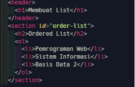
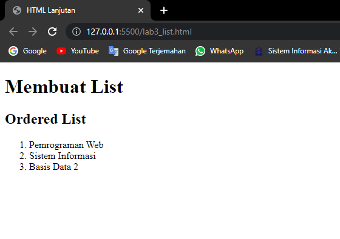
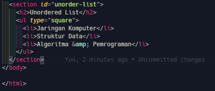
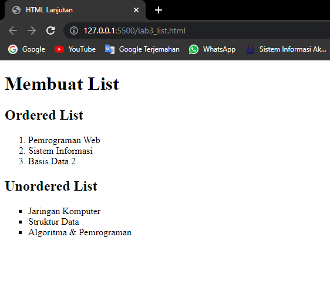
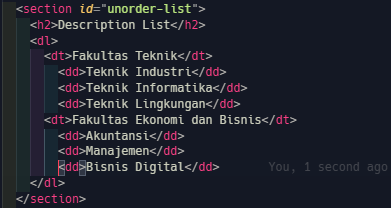
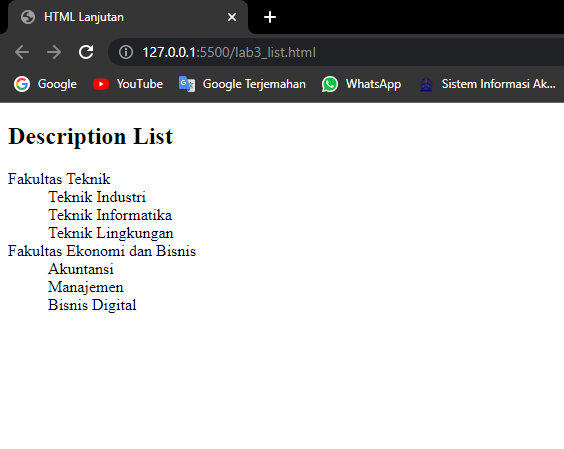

# Lab3Web

Praktikum 3: Membuat List, Table dan Form

## membuat list

`HTML List memungkinkan untuk mengelompokkan sekumpulan item terkait dalam sebuah daftar.`

ada 3 jenis list:

1.  Ordered List
    menggunakan tag

        <ol>
          <li>...</li>
        </ol>

2.  Unordered List
    menggunakan tag

        <ul>
          <li>...</li>
        </ul>

3.  Description List
    menggunakan tag

        <dl>
          <dt>...</dt>
          <dd>...</dd>
        </dl>

### langkah langkah praktikum

1.  buat struktur dasar `HTML`

        <!DOCTYPE html>
        <html lang="en">
        <head>
          <meta charset="UTF-8">
          <meta http-equiv="X-UA-Compatible" content="IE=edge">
          <meta name="viewport" content="width=device-width, initial-scale=1.0">
          <title>Document</title>
        </head>
        <body>

        </body>
        </html>

2.  membuat **Ordered List**

maka akan tampil sebagai berikut

3. membuat **Unordered List**

maka akan tampil sebagai berikut

4. Membuat **Description List**
   Kemudian tambahkan kode untuk membuat description list setelah deklarasi unorderd-list.

maka akan tapil sebagai berikut

