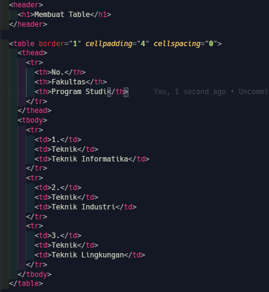
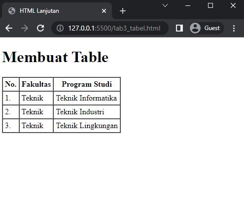
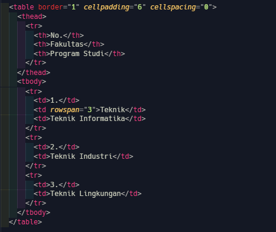
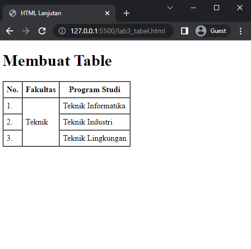
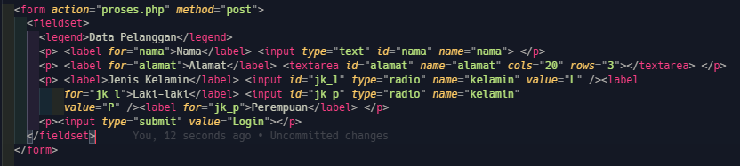
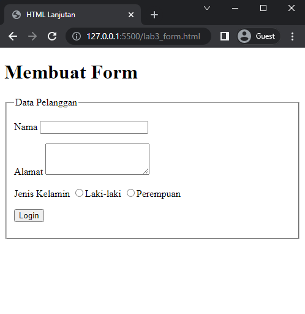
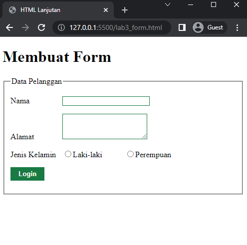

# Lab3Web

Praktikum 3: Membuat List, Table dan Form

## membuat list

`HTML List memungkinkan untuk mengelompokkan sekumpulan item terkait dalam sebuah daftar.`

ada 3 jenis list:

1.  Ordered List
    menggunakan tag

        <ol>
          <li>...</li>
        </ol>

2.  Unordered List
    menggunakan tag

        <ul>
          <li>...</li>
        </ul>

3.  Description List
    menggunakan tag

        <dl>
          <dt>...</dt>
          <dd>...</dd>
        </dl>

### langkah - langkah praktikum

1.  buat struktur dasar `HTML`

        <!DOCTYPE html>
        <html lang="en">
        <head>
          <meta charset="UTF-8">
          <meta http-equiv="X-UA-Compatible" content="IE=edge">
          <meta name="viewport" content="width=device-width, initial-scale=1.0">
          <title>Document</title>
        </head>
        <body>

        </body>
        </html>

2.  membuat **Ordered List**

maka akan tampil sebagai berikut

3. membuat **Unordered List**

maka akan tampil sebagai berikut

4. Membuat **Description List**
   Kemudian tambahkan kode untuk membuat description list setelah deklarasi unorderd-list.

maka akan tapil sebagai berikut

## membuat tabel

Penjelasan HTML table. Tabel (Table) adalah sebuah data tabular dalam bentuk grid yang terdiri dari kolom (column), baris (row) dan celll yang merupakan pertemuan antara kolom dan baris. HTML `<table>` element merepresentasikan data dengan lebih dari satu dimensi dalam bentuk sebuah tabel (table).

#### tag yang ada di dalam table

1. td (Table Data) : digunakan untuk membuat kolom dan disisipkannya data.
2. tr ( Table Row) : digunakan untuk membuat baris table.
3. th (Table Header) : fungsinya sama seperti tag td, tetapi terletak di baris pertama dan sebagai header dari table.

### langkah - langkah praktikum

1.  buat struktur dasar `HTML`

        <!DOCTYPE html>
        <html lang="en">
        <head>
          <meta charset="UTF-8">
          <meta http-equiv="X-UA-Compatible" content="IE=edge">
          <meta name="viewport" content="width=device-width, initial-scale=1.0">
          <title>Document</title>
        </head>
        <body>

        </body>
        </html>

Kemudian selanjutnya tambahkan kode untuk membuat tabel sederhana seperti berikut:

Untuk mengatur margin dan padding pada cel data, tambahkan atribut cellpadding dan cellspacing pada tag table.

    <table border="1" cellpadding="4" cellspacing="0">

maka akan tampil sebagai berikut

2. Menggabungkan Sel Data
   Untuk menggabungkan sel data, gunakan atribut rowspan dan colspan. Atribut rowspan untuk menggabungkan baris (secara vertikal) dan colspan untuk menggabungkan kolom (secara horizontal).

maka kolom ke 2 akan menjadi satu baris

## membuat form

Form merupakan salah satu bentuk halaman web yang digunakan untuk menerima masukan dari pengguna, untuk selanjutnya masukan dari pengguna tersebut diolah menggunakan bahasa pemrograman web, baik secara server side scripting(misalkan PHP, JSP) ataupun client-side scripting (javascript). 

Form di HTML dapat kita buat dengan tag `<form>` . Tag ini memiliki beberapa atribut yang harus diberikan, seperti: action untuk menentukan aksi yang akan dilakukan saat data dikirim; method metode pengiriman data.

### langkah - langkah praktikum

1.  membuat struktur dasar `HTML`

        <!DOCTYPE html>
        <html lang="en">

        <head>
          <meta charset="UTF-8">
          <meta http-equiv="X-UA-Compatible" content="IE=edge">
          <meta name="viewport" content="width=device-width, initial-scale=1.0">
          <title>HTML Lanjutan</title>
        </head>

        <body>
          <header>
            <h1>Membuat Form</h1>
          </header>
        </body>

        </html>

Kemudian selanjutnya tambahkan kode untuk membuat tabel sederhana seperti berikut:

maka akan menampilkan form berikut

2. Menabahkan Style pada Form
Agar tampilan form lebih menarik, bisa ditambahkan CSS seperti berikut.

        

